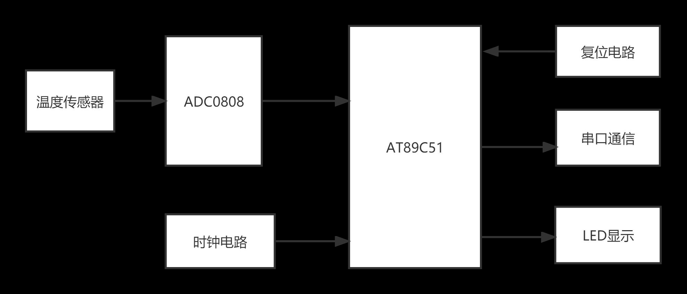
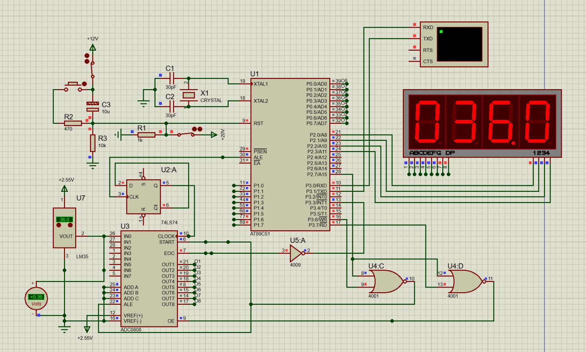
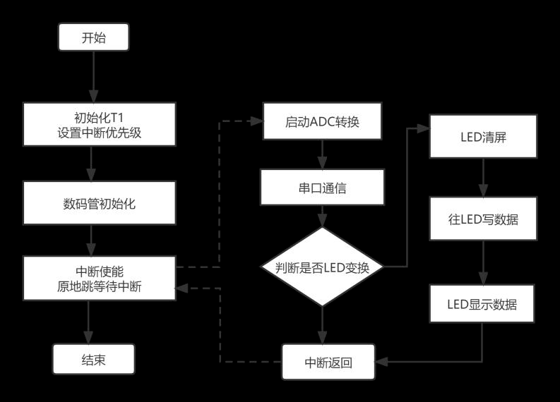
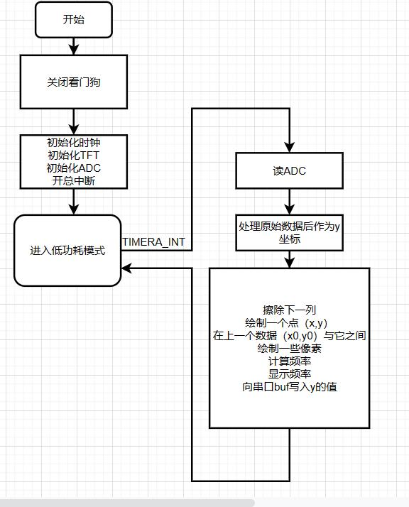
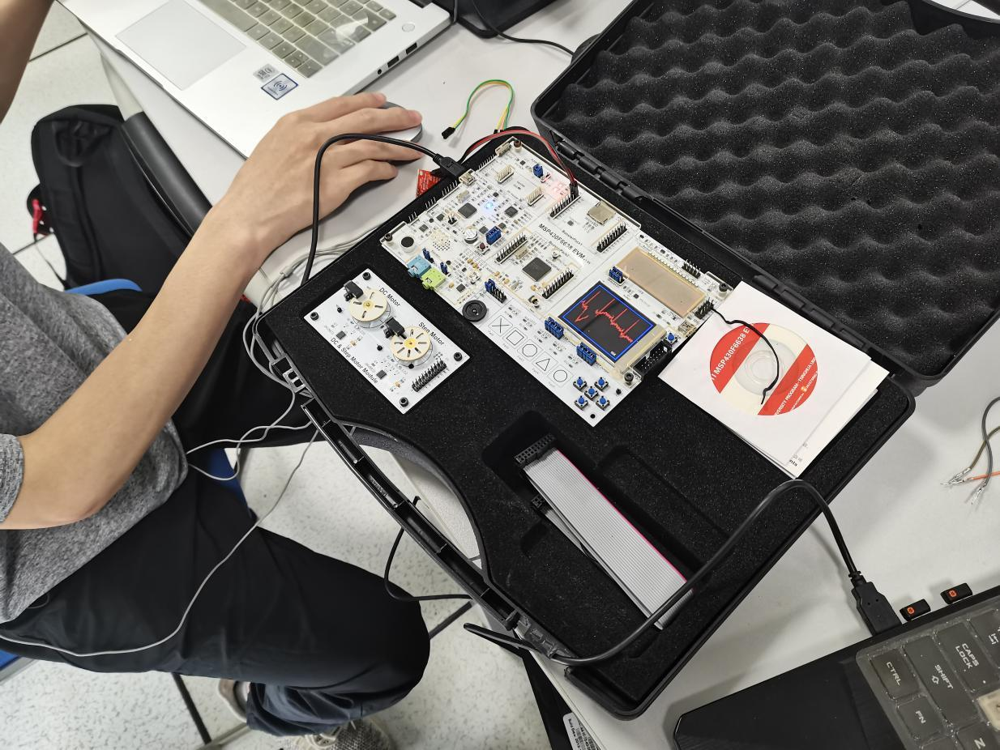
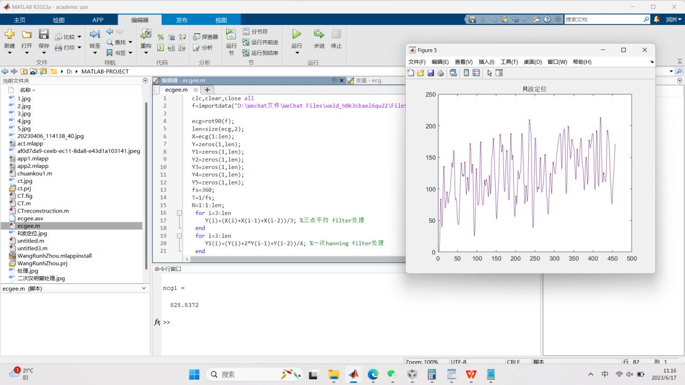

# Embedded-Systems
《嵌入式计算机系统》和《微机原理》课程作业

## 1.基于MSC51的数字体温计设计
### 1.1设计要求

>在Proteus 环境下，基于MCS-51，采用并行接口的ADC0809模数转换器和模拟温度传感器，设计了一个数字体温计，具体包括
>1）模拟温度信号的采集和模数转换，
>2）AD采集，以及ADC与单片机的接口，
>3）单片机对输入数字信号的处理，显示和传输（基于UART的无线蓝牙传输和接收）等功能。


### 1.2硬件设计



### 1.3软件设计
[代码传递门](基于8051的数字体温计\test.a51)



----------------------------------------------------------------------------------------------------------------------------
## 2.基于MSP430的心电采集显示心率计数系统
### 2.1设计要求
> 1.心电信号采集电路设计，通过ADC模块采集心电信号；
>2.通过MSP430内部ADC模块采集TEB-Muscle Sensor 肌电传感器输出的肌电放大信号；
>3.在MSP430的点阵LCD上显示肌电波形，并计算肌电的均方值。
>4.通过UART-RS232-USB 接口将肌电信号传输到PC端，显示原始数据和波形；

### 2.2 流程图


### 2.3 结果展示



----------------------------------------------------------------------------------------------------------------------------
## 3.微机原理实验
实验1 简单运算和延时
```
[设计要求]
1．在数据段建立以 NUMB 为首址，以 byte 为单位的数据区域，NUMB 和 NUMB+1单元分别为36H和18H, 再编写 .EXE 程序，求这两个数的差与商。
2．用 NOP 指令编一段完整的 .EXE 延时程序，循环 40000 次。
3．观察有关寄存器、存储单元和 FLAGS 的改变。
4. 掌握汇编语言集成IDE调试环境，学会编译、链接、断点、全速、寄存器、存储器、标志位查阅等
 ```

实验2 人机对话(5分)
```
[目的] 学习和熟悉DOS功能调用。
[设计要求]
1.程序执行后，首先询问：
       What’s your name？
2.要求用户键入回答，例如输入：lily。
3.再次询问:
       Which class are you in？
4.要求用户再次键入回答，例如输入：F0008201。
5.回车换行。
6.显示：Your name is lily，and your class is F0008201. confirm(y/n)。
7.如果回答y，退出程序；否则，返回1。
[设计思路]
1.程序通过Dos的9号功能调用显示字符串。
2.通过调用Dos的0A号功能显示和接收输入的字符串。
3.单个控制键可通过调用Dos的2号功能来完成。
4.接收单个字符可调用Dos的1号功能来完成。
5.注意接收完字符串后，加入串结束符。
 ```

实验3 统计、求和与*排序（35分）
 ```
[目的] 熟悉循环和子程序调用的编程方法
[设计要求]
1．从键盘随机输入十个数据，统计其中负数的个数，并在屏幕上显示出来；
2．求出这十个数的总和， 存入数据段SUM 单元，并在屏幕上显示出来；
3．* 将这些数从小到大排序，存入 ORDER 为首址的存储区域，并在屏幕上显示出来。
4．** 编一跳转表，按键1，2，3，分别执行上述三种操作。
5．-99999到+99999排序；
6．识别错误符号并提示修改；
7．识别超程数字并要求重新输入；
8．顺利运行，无BUG。
 ```

实验4 动态的标题栏与图形（15分）
```
[目的] 熟悉图形方式BIOS功能
[设计要求] 
1．做一个动态显示的彩色标题栏；
2．在屏幕中央动态的画一个彩色的圆环。画圆环的过程中变换两种颜色。
3．* 在原来的圆环内画一个内接正方形。
[设计思路]
1．动态显示的原理，就是显示和延时这两项操作交替使用。
2．画园之前可以算出坐标值，存放于数据段。
 ```

实验5 代码转换（10分）
```
[目的] 将键盘输入的4位十六进制数转换成等值的十进制数送屏幕显示。
[设计要求]
1．程序执行后，首先给出操作提示：
          Please input a 4-bit hexadecimal number：
2．程序要有保护措施，对于非法键入不受理、不回显，但可重新输入。
3．显示合法键入的数据，当收到第4位合法数据后，立即显示转换结果。
4．显示格式示范如下：
        ABCDH=43981
[设计思路]
1.程序通过DOS或BIOS调用得到的输入数据均是键盘字符的ASCII码。而程序送往屏幕显示的数据，也都是该数的ASCII码。
2.根据设计要求，程序应首先辨别键入的数据是否在‘0’—‘9’和‘A’—‘F’之间，不在这个范围就是非法键入。
3.DOS系统的7号和8号子功能，对键入的字符没有回显功能，如果键入的字符是合法数据，再用单字符输出的子功能“回显”合法数据，即可达到显示合法数据而不显示非法数据这一设计要求。
4.代码转换的方法：首先把键入的十六进制数ASCII码，转换成等值的二进制数，然后再把二进制数转换成十进制数。
 ```

实验6 简单的电子琴 --- 8254的应用（15分）
```
[目的]  熟悉8254 在微机系统中的应用。
[设计要求]  
利用机内 8254 芯片和扬声器, 编一简单的电子琴演奏程序, 按键盘数字键
1 — 7，发出相应简谱音符的声调（C调），每次按键后，持续发音 1 秒钟。键入“0”结束。 
[设计思路]
1. 只接受键 0 – 7, 屏蔽其余键。 然后将1-7 的ASCII 码转换为数值。
2. 可利用1-7 的数值，作为数据区的指针。因为音频以word 为单元存放，1-7的数值应乘以2 。
3．* 把以上这一操作运用转移地址表的方式的进行。

 ```
实验7 模块化程序设计（20分）
```
[目的] 练习模块化程序的设计。
[设计要求]
设计一个主菜单，并将实验3~8的程序作为子菜单的运行结果。
通过链接几个代码段的方式实现。
 ```